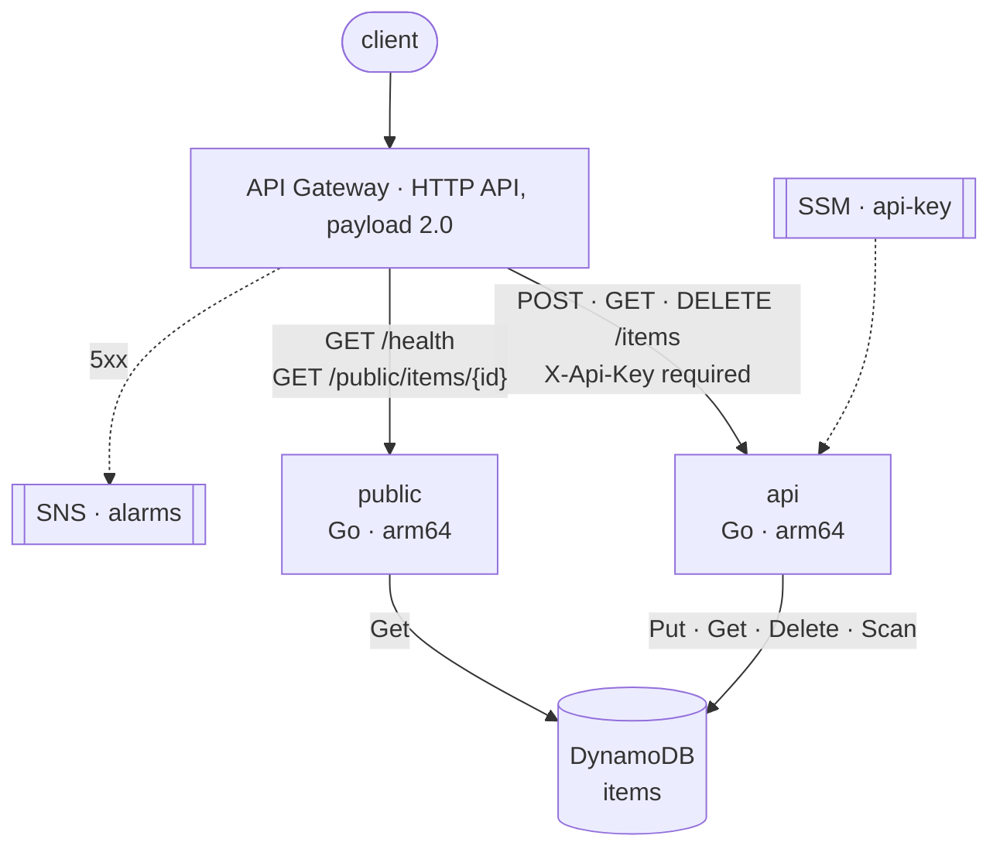

# Go AWS Serverless Starter

[](../../actions/workflows/ci.yml)
[](https://antoinepoisson.github.io/Go-AWS-Serverless-Starter/)


[](LICENSE)

A serverless API in Go you can deploy on the first day and still trust on the
hundredth: API Gateway HTTP API, two Lambda functions, one DynamoDB table.

Use the template, run one command, replace the example resource with your own.
The infrastructure, the quality gates, the generated documentation and the
delivery pipeline are already wired — most examples stop at a deployed Lambda,
this one starts there.

## Architecture



Each function carries its own IAM role, so the public one cannot write.

## Getting started

Needs Go 1.26.6, Node.js 22 and Docker.

```sh
make init          # make the template yours, then install and start everything
make run-api       # in one shell: api on :8080
make run-public    # in another:   public on :8081
```

```sh
curl -s -X POST localhost:8080/items \
  -H 'X-Api-Key: local-dev-key' \
  -d '{"name":"first item","tags":["demo"]}'
```

`make init` asks for a Go module path and a service name, rewrites both across
the repository, restarts the version history, then installs the dependencies and
the git hooks, regenerates the specification, prepares `.env` and creates the
local table. It is the only step that knows about the template — everything
after it is your project. Run it directly to skip the prompts:

```sh
./initialize.sh --module github.com/acme/orders-api --service orders-api
```

The `items` resource is an example: a small CRUD that exercises every layer end
to end. Replace it with yours and the plumbing stays. `make help` lists every
target; `.env.example` documents every setting and is what local runs and
integration tests read.

## What's inside

| Area | Implementation |
| ---- | -------------- |
| Runtime | Go on AWS Lambda, `provided.al2023`, arm64 |
| HTTP | Standard `net/http`, API Gateway payload v2 adapter |
| Storage | DynamoDB, DynamoDB Local for development |
| Injection | Google Wire, generated injectors |
| Documentation | OpenAPI generated from the annotations, validated by Redocly |
| Tests | `go test` with the race detector, DynamoDB Local, Playwright |
| Infrastructure | Serverless Framework, one IAM role per function |
| Monitoring | API Gateway access logs, 5xx alarm and one SNS topic per stage |
| Delivery | GitHub Actions, OIDC, artifact promotion |
| Releases | Conventional Commits and Release Please |

## Quality gates

Eight checks run on every pull request and a red one stops the deploy on every
stage; a ninth guards the generated files in a pre-push hook. Most of them also
run locally, before the code leaves the machine.

| Check | What it enforces | Runs on |
| ----- | ---------------- | ------- |
| Formatting | rewritten and restaged on commit, reported with `--diff` in CI | commit, CI |
| Lint | 13 linters on top of the standard set; `godox` on protected branches | commit, CI |
| Vulnerabilities | reachable Go symbols and advisory-specific Node tooling audit | CI |
| Unit tests | race detector on, **80% coverage floor** | push, CI |
| Integration | the repository against a real DynamoDB | CI |
| End-to-end | Playwright against both functions, wired to DynamoDB | CI |
| API drift | the specification is regenerated and diffed | push, CI |
| Codegen drift | Wire injectors and mocks regenerated and diffed | push |
| Infrastructure | all three stages rendered to CloudFormation | CI |

Coverage is measured with `-coverpkg`, so a package covered by another package's
tests counts, and excludes the generated code and every `main()`. Below 80% the
job fails rather than warns — `make cover` gives the same verdict locally.

## Stages and delivery

One branch per stage. A push deploys once every check passes, and the release
job only runs after a successful deploy, so a tag can never point at code that
was never shipped. The artifacts that ship are the very zips the checks ran
against, never a rebuild.

| Branch | Deploys to | Releases |
| ------ | ---------- | -------- |
| `dev`  | `alpha`    | — |
| `main` | `preprod`  | prereleases `vX.Y.Z-pre.N` |
| `prod` | `prod`     | stable `vX.Y.Z` |

Stages are declared in `serverless/stage/`; add a file there to add one. `alpha`
is throwaway — verbose logs, CORS open, table dropped with the stack. `preprod`
mirrors `prod`, so a release is rehearsed under the same constraints.

Deployment is opt-in, so a repository with no AWS account behind it stops after
the checks instead of failing. To turn it on, set the repository variables
`DEPLOY_ENABLED` to `true` and `AWS_REGION`, and the repository secret
`AWS_DEPLOY_ROLE_ARN` — the role CI assumes through OIDC. Production approval
belongs in the `prod` GitHub Environment as a required reviewer.

Two things per stage before the first deploy: the API key it reads from SSM, and
a subscriber on the alarm topic the stack creates — its ARN is the
`AlarmTopicArn` output.

```sh
aws ssm put-parameter --name /go-aws-serverless-starter/alpha/api-key \
  --type SecureString --value "$(openssl rand -hex 32)"
aws sns subscribe --topic-arn "$ALARM_TOPIC_ARN" \
  --protocol email --notification-endpoint you@example.com
```

The key is resolved at deploy time, so it ends up in the rendered
CloudFormation template and in the function's environment: whoever can read the
stack or the Lambda configuration can read the key. That is the price of a
shared secret in an environment variable, and rotating it is a deploy. Read the
parameter at cold start instead, or move the check to a Lambda authorizer, if
the value has to stay inside Parameter Store.

The OpenAPI reference badge at the top is published to GitHub Pages from
`main`.

Before your first release: commits must follow
[Conventional Commits](https://www.conventionalcommits.org), which `commitlint`
enforces in a hook, and auto-merge must stay off on the release pull requests —
a push authenticated with `GITHUB_TOKEN` triggers no workflow, so the tagged
version would never deploy.

## Design decisions

- **Standard `net/http`.** The functions are ordinary HTTP applications, which
  keeps local development and most tests independent from the Lambda runtime.
- **Two functions, not one.** Public and authenticated routes deploy separately,
  so their environment variables and IAM permissions stay isolated.
- **A generated specification.** The contract comes from the handler
  annotations and CI diffs it, at the cost of keeping the annotations next to
  the HTTP layer.
- **A branch per environment.** An opinionated default; replace it with
  trunk-based delivery by rewiring the `resolve` job of the pipeline.

## Not included

This is a technical foundation, not an application platform. It deliberately
leaves out end-user identity and Cognito, business authorization, asynchronous
messaging, multi-tenant data modelling, custom domains and WAF, and distributed
tracing. The API key middleware is a replaceable service-to-service boundary,
not a user authentication system.

The example list deliberately uses one bounded DynamoDB `Scan` without a
cursor. It keeps the demo readable; replace it with a paginated `Query` and an
index shaped around your access pattern when the example becomes real data.

## Layout

```
lambda/api        authenticated CRUD, Wire injector, middleware chain
lambda/public     health and read-only endpoints
internal/config   environment-backed settings
internal/httpx    router, JSON responses, errors, middlewares, Lambda adapter
internal/item     model, DynamoDB repository, use cases
internal/awsx     the AWS SDK clients
serverless/       function definitions, DynamoDB table, alarms, stage files
tasks/            build, deploy, local, codegen and documentation tasks
docs/             OpenAPI general information, generated specification
tools/localdb     creates the items table in DynamoDB Local
e2e/              Playwright tests
```

## License

MIT — see [LICENSE](LICENSE).
